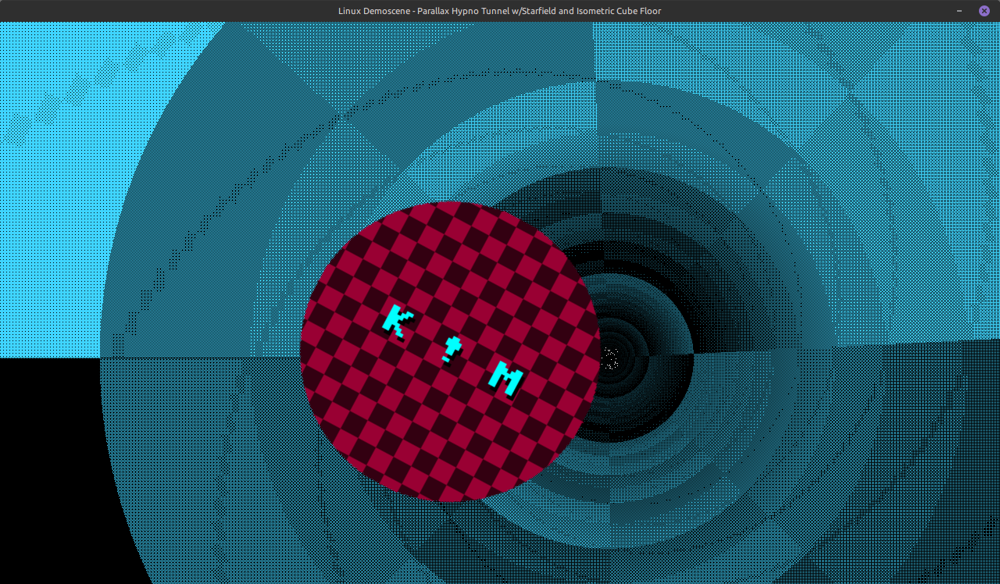

# hypno-tunnel-python3

A little excercise for myself porting yet another demoscene'ish program from C into Python3, showing off classic Amiga demoscene-like graphics, **On Linux**.

Made with C using SDL2 that implements a perspective checkered spinning tunnel, Bresenham's Line Algortihm moving starfield and a isometric polygon cube moving floor. Now with a soundbyte bgm loop!

Should work on any Linux distribution that has `SDL2` + `SDL2_mixer`.

## Required:
```bash
pip install pygame numpy
```

Usage:
```bash
$ ./hypno-tunnel -f / --fullscreen /  -w 1280 -h 720 / --width 1280 --height 720
```

#### What:
- `-O3` optimized demoscene binary (`20KB`).
- `40KB` soundbyte loop (courtesy of [**k!M**](https://soundcloud.com/kim-olsen-357297567)), making the total size 60KB!

#### How:
- **Perspective Tunneling**: Rings scale with non-linear power distribution ($r^{2.2}$) to give a 3D depth-vanishing effect toward the horizon vanishing point.
- **Animated Luminance**: A sine-driven travelling wave calculates greyscale intensity ($lum \in [10, 250]$) across the concentric rings along with subtle axial rotation ($t \times 0.2$).
- **Back-to-Front Compositing**: The tunnel renders first directly onto the backbuffer, allowing the isometric floor cubes to cleanly occlude the bottom portion of the tunnel.
- It uses **Bresenham's Line Algorithm** for parrallax star trails.
- Isometric cube floor: We replace ASCII characters with filled polygonal quads, dramatically increasing the visual quality while keeping the same 2:1 isometric projection math and back-to-front rendering order.


