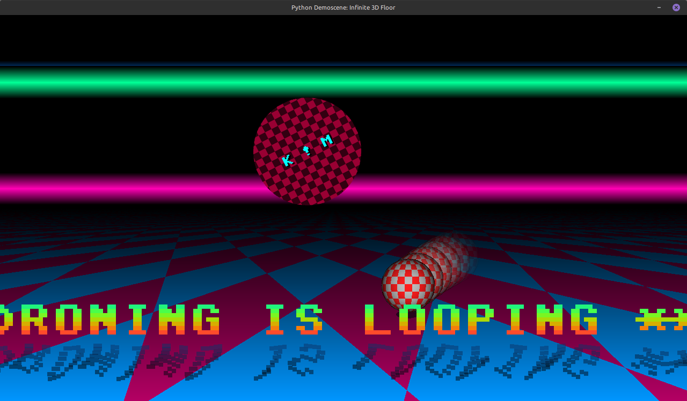

# infinite-3d-floor-python3

A personal challenge creating yet another demoscene'ish program in `Python3`, showing off classic Amiga demoscene-like "_infinite floor_" graphics effect, scrolling text with water drop-shadow and a bouncing Boing Ball, **On Linux** :P

Made with Python3 using PyGame that implements a perspective checkered spinning tunnel, Bresenham's Line Algortihm moving starfield and a isometric polygon cube moving floor. Now with a soundbyte bgm loop!

Should work on any Linux distribution that has `Python3` + `PyGame`.

Sound loop provided by [CallRoll](https://archive.org/details/free-chiptune-collection-for-game-usage).

## Required:
```bash
sudo apt-get install python3 python3-pygame python3-numpy
```

Usage:
```bash
$ ./infinite-3d-floor.py -f / --fullscreen /  -w 1280 -h 720 / --width 1280 --height 720
```

#### How:
- **Perspective Floor**: map the 2D screen pixels of the bottom half of the screen into 3D world space using a depth divisor (Distance $Z = \frac{\text{Camera Height}}{Y}$).
- **Rotozoomer Overlay**: A smaller, floating texture (like a logo or text) spinning and scaling smoothly across the screen, rendered directly into the pixel buffer on top of the 3D floor.
- **Boing Ball**: The "Boing Ball" is the ultimate crown jewel of the Amiga demoscene! To do it justice, we won’t just move a flat 2D sprite around. We will use NumPy to calculate a true 3D raycasted sphere with a wrapping checkerboard texture that dynamically rotates and depth-shades itself every single frame.


